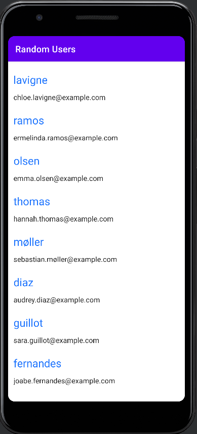
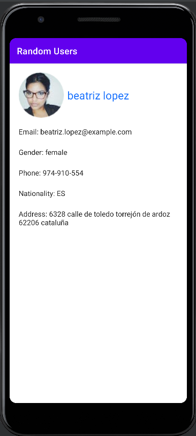

# random-user-api-android
Android project using random user API https://randomuser.me/ an image generator API
Project use:
- Recycler view to display list of users with item details with user image and details
- Retrofit to manage API call
- Coil to manage picture display
- Room for database local storage
- Koin for DI
- Navigation component to navigate in the app

# Screenshots

# License

**random-user-api-android** is distributed under the terms of the Apache License (Version 2.0). See the
[license](LICENSE) for more information.

Feel free to use it
